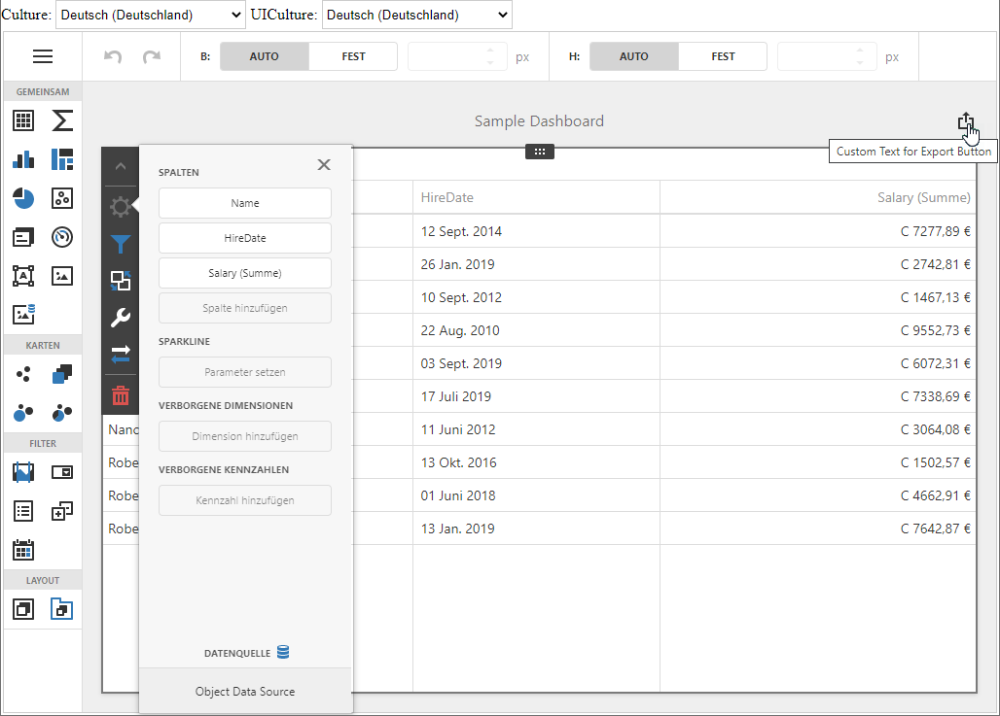

<!-- default badges list -->

<!-- default badges end -->
# Dashboard for Blazor Server - Localization

The example shows how to localize the Dashboard component in Blazor Server applications:

- Translate UI element captions to a different language: dialog boxes, buttons, menu items, error messages, and so on (localization).
- Format numbers, dates, and currencies according to specific culture settings (globalization).

The app uses **satellite resource assemblies** to localize the Dashboard component. You can obtain localized resources from our [Localization Service](https://docs.devexpress.com/LocalizationService/16235/localization-service).

A custom [CultureSelector](./CS/BlazorDashboardApp/Components/CultureSelector.razor) UI component is implemented to allow users to change the culture at runtime. The app saves the current culture in a cookie.

The [ResourceManager.setLocalizationMessages](https://docs.devexpress.com/Dashboard/js-DevExpress.Dashboard.ResourceManager?p=netframework#js_devexpress_dashboard_resourcemanager_setlocalizationmessages_static_localizationmessages_) method is used to localize the specified string at runtime (the "Export To" button's caption in the dashboard title).

## Files to Review

* [Dashboard.razor](./CS/BlazorDashboardApp/Pages/Dashboard.razor)
* [CultureSelector.razor](./CS/BlazorDashboardApp/Components/CultureSelector.razor)
* [CultureController.cs](./CS/BlazorDashboardApp/Controllers/CultureController.cs)
* [_Layout.cshtml](./CS/BlazorDashboardApp/Pages/_Layout.cshtml#L35-L49)
* [Program.cs](./CS/BlazorDashboardApp/Program.cs)

## Documentation

- [Create a Blazor Server Dashboard Application](https://docs.devexpress.com/Dashboard/403029)

## More Examples

- [Dashboard for Blazor WebAssembly - Localization](https://github.com/DevExpress-Examples/dashboard-blazor-webassembly-localization)
- [Dashboard Blazor Server App - Configuration](https://github.com/DevExpress-Examples/dashboard-blazor-server-configuration)
- [Dashboard Blazor Server App - JavaScript Customization](https://github.com/DevExpress-Examples/dashboard-blazor-server-js-customization)
<!-- feedback -->
## Does this example address your development requirements/objectives?

 

(you will be redirected to DevExpress.com to submit your response)
<!-- feedback end -->
